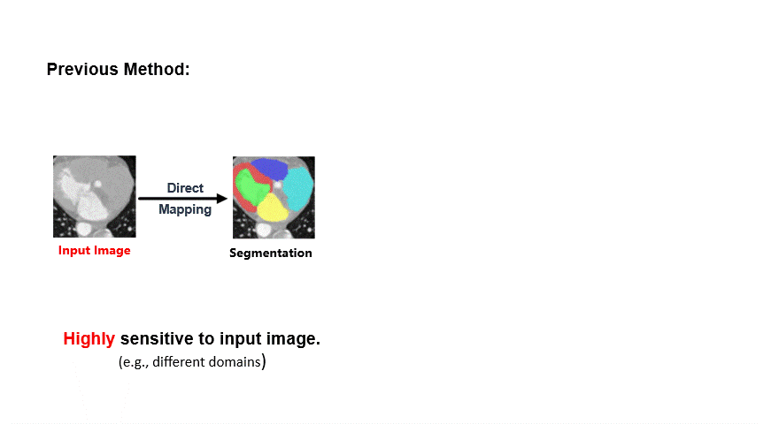

<div align="center">
    <h1>
    DiffAtlas: GenAI-fying Atlas Segmentation via Image-Mask Diffusion
    </h1>
    <p>
    </p>
    <a href="https://arxiv.org/abs/2503.06748"></a>
    <a href="https://huggingface.co/datasets/YuheLiuu/DiffAtlas_Preprocessed_Data"></a>
    <a href="https://huggingface.co/YuheLiuu/DiffAtlas_Pretrained_model"></a>
    <a href="https://github.com/M3DV/DiffAtlas"></a>
</div>

## 💻 Overview

<div align="center">
	
</div>

Accurate medical image segmentation is crucial for precise anatomical delineation. Deep learning models like U-Net have shown great success but depend heavily on large datasets and struggle with domain shifts, complex structures, and limited training samples. Recent studies have explored diffusion models for segmentation by iteratively re f ining masks. However, these methods still retain the conventional image to-mask mapping, making them highly sensitive to input data, which hampers stability and generalization. In contrast, we introduce DiffAt las, a novel generative framework that models both images and masks through diffusion during training, effectively “GenAI-fying” atlas-based segmentation. During testing, the model is guided to generate a specific target image-mask pair, from which the corresponding mask is obtained. DiffAtlas retains the robustness of the atlas paradigm while overcoming its scalability and domain-specific limitations. Extensive experiments on CT and MRI across same-domain, cross-modality, varying-domain, and different data-scale settings using the MMWHS and TotalSegmentator datasets demonstrate that our approach outperforms existing methods, particularly in limited-data and zero-shot modality segmentation. 

## 📖 Dataset

```
└── MMWHS
    ├── CT
    │   ├── training_set_full
    │   ├── testing_set
    |   └── all
    └── MRI
        ├── training_set_full
        ├── testing_set
        └── all
```

```
└── TotalSegmentator
	├── training_set
    └── testing_set
```

## 🔩 Quick Installation

- Create a virtual environment and activate it 

  ```
  conda create -n diffatals python=3.10
  conda activate diffatals
  ```

- Download the code

  ```
  git clone https://github.com/M3DV/DiffAtlas.git
  ```

- Check if your pip version is 22.3.1. If it is not, install pip version 22.3.1

  ```
  pip install pip==22.3.1
  ```

- Enter the DiffAtlas folder and install the requirements.

  ```
  cd DiffAtlas
  pip install -r requirements.txt
  ```

## 🔌 Get Started

- Download the MMWHS dataset from ([HuggingFace🤗](https://huggingface.co/datasets/YuheLiuu/DiffAtlas_Preprocessed_Data/tree/main/MMWHS))

  ```
  cd DiffAtlas
  mkdir -p data
  cd data
  mkdir MMWHS
  cd MMWHS
  # download MMWHS-CT
  mkdir CT
  cd CT
  wget https://huggingface.co/datasets/YuheLiuu/DiffAtlas_Preprocessed_Data/resolve/main/MMWHS/CT/all.zip
  unzip all.zip
  wget https://huggingface.co/datasets/YuheLiuu/DiffAtlas_Preprocessed_Data/resolve/main/MMWHS/CT/testing_set.zip
  unzip testing_set.zip
  wget https://huggingface.co/datasets/YuheLiuu/DiffAtlas_Preprocessed_Data/resolve/main/MMWHS/CT/training_set_full.zip
  unzip training_set_full.zip
  cd ..
  # download MMWHS-MRI
  mkdir MRI
  cd MRI
  wget https://huggingface.co/datasets/YuheLiuu/DiffAtlas_Preprocessed_Data/resolve/main/MMWHS/MRI/all.zip
  unzip all.zip
  wget https://huggingface.co/datasets/YuheLiuu/DiffAtlas_Preprocessed_Data/resolve/main/MMWHS/MRI/testing_set.zip
  unzip testing_set.zip
  wget https://huggingface.co/datasets/YuheLiuu/DiffAtlas_Preprocessed_Data/resolve/main/MMWHS/MRI/training_set_full.zip
  unzip training_set_full.zip
  ```

- Download the TotalSegmentator dataset from ([HuggingFace🤗](https://huggingface.co/datasets/YuheLiuu/DiffAtlas_Preprocessed_Data/tree/main/TotalSegmentator))

  ```
  cd DiffAtlas
  mkdir -p data
  mkdir TotalSegmentator
  cd TotalSegmentator
  wget https://huggingface.co/datasets/YuheLiuu/DiffAtlas_Preprocessed_Data/resolve/main/TotalSegmentator/test.zip
  unzip test.zip
  wget https://huggingface.co/datasets/YuheLiuu/DiffAtlas_Preprocessed_Data/resolve/main/TotalSegmentator/train.zip
  unzip train.zip
  ```

You can download the entire dataset or only part of it according to your needs. It is worth noting that in MMWHS/CT and MMWHS/MRI, `all` actually equals the sum of all the data in `testing_set` and `training_set_full`. The reason for listing “all” separately is to facilitate cross-domain training and testing.

## 🏃 Train DiffAtlas Model

The training scripts are all stored in the `training_scripts` folder, and the specific training methods are as follows:

- Train on all training data of MMWHS-CT

  ```
  chmod +X ./traing_scripts/train_MMWHSCT_full_training_set.sh
  ./traing_scripts/train_MMWHSCT_full_training_set.sh
  ```

- Train on all data of MMWHS-CT

  ```
  chmod +X ./traing_scripts/train_MMWHSCT_all.sh
  ./traing_scripts/train_MMWHSCT_full_all.sh
  ```

- Train on all training data of MMWHS-MRI

  ```
  chmod +X ./traing_scripts/train_MMWHSMRI_full_training_set.sh
  ./traing_scripts/train_MMWHSMRI_full_training_set.sh
  ```

- Train on all data of MMWHS-MRI

  ```
  chmod +X ./traing_scripts/train_MMWHSMRI_all.sh
  ./traing_scripts/train_MMWHSMRI_full_all.sh
  ```

- Train on all training data of TotalSegmentator

  ```
  chmod +X ./traing_scripts/train_TotalSegmentator.sh
  ./traing_scripts/train_TotalSegmentator.sh
  ```

## 🎯 Evaluation

All the testing scripts are stored in the `testing_scripts` folder. You can use them to test the training results.

If you need to obtain the pretrained weights, please perform the following steps first :

```
mkdir -p Model
cd Model 
```

**Note:** If you want to perform inference with your own trained results, please modify the `model_num` parameter in the script to the specified weights and skip the steps below for downloading the pretrained weights.

- Train on all training data of MMWHS-CT, and test on the training set of MMWHS-CT

  get pretrained model :

  ```
  mkdir -p DiffAtlas_MMWHS-CT_full
  cd DiffAtlas_MMWHS-CT_full
  wget -o pretrained_MMWHSCT_full https://huggingface.co/YuheLiuu/DiffAtlas_Pretrained_model/resolve/main/MMWHSCT_full.pt
  cd ../..
  ```

  start inference :

  ```
  chmod +x ./testing_scripts/test_MMWHSCT_testing_set
  ./testing_scripts/test_MMWHSCT_all_testing_set
  ```

- Train on all data of MMWHS-CT, and test on all data of MMWHS-MRI

  get pretrained model :

  ```
  mkdir -p DiffAtlas_MMWHS-CT_all
  cd DiffAtlas_MMWHS-CT_all
  wget -o pretrained_MMWHSCT_all https://huggingface.co/YuheLiuu/DiffAtlas_Pretrained_model/resolve/main/MMWHSCT_all.pt
  cd ../..
  ```

  start inference :

  ```
  chmod +x ./testing_scripts/test_MMWHSMRI_all
  ./testing_scripts/test_MMWHSMRI_all
  ```

- Train on all training data of MMWHS-MRI, and test on the training set of MMWHS-MRI

  get pretrained model :

  ```
  mkdir -p DiffAtlas_MMWHS-MRI_full
  cd DiffAtlas_MMWHS-MRI_full
  wget -o pretrained_MMWHSMRI_full https://huggingface.co/YuheLiuu/DiffAtlas_Pretrained_model/resolve/main/MMWHSMRI_full.pt
  cd ../..
  ```

  start inference :

  ```
  chmod +x ./testing_scripts/test_MMWHSMRI_testing_set
  ./testing_scripts/test_MMWHSMRI_all_testing_set
  ```

- Train on all data of MMWHS-MRI, and test on all data of MMWHS-CT

  get pretrained model :

  ```
  mkdir -p DiffAtlas_MMWHS-MRI_all
  cd DiffAtlas_MMWHS-MRI_all
  wget -o pretrained_MMWHSMRI_all https://huggingface.co/YuheLiuu/DiffAtlas_Pretrained_model/resolve/main/MMWHSMRI_all.pt
  cd ../..
  ```

  start inference :

  ```
  chmod +x ./testing_scripts/test_MMWHSCT_all
  ./testing_scripts/test_MMWHSCT_all
  ```

- Train on all training data of TotalSegmentator, and test on the test data of TotalSegmentator

  get pretrained model :

  ```
  mkdir -p DiffAtlas_TotalSegmentator
  cd DiffAtlas_TotalSegmentator
  wget -o pretrained_TotalSegmentator_for_TotalSegmentatorTest https://huggingface.co/YuheLiuu/DiffAtlas_Pretrained_model/resolve/main/TotalSegmentator_for_TotalSegmentatorTest .pt
  cd ../..
  ```

  start inference :

  ```
  chmod +x ./testing_scripts/test_TotalSegmentator
  ./testing_scripts/test_TotalSegmentator
  ```

- Train on all training data of TotalSegmentator, and test on all data of MMWHS-MRI

  get pretrained model :

  ```
  mkdir -p DiffAtlas_TotalSegmentator
  cd DiffAtlas_TotalSegmentator
  wget -o pretrained_TotalSegmentator_for_MMWHSMRITest https://huggingface.co/YuheLiuu/DiffAtlas_Pretrained_model/resolve/main/TotalSegmentator_for_MMWHSMRITest.pt
  cd ../..
  ```

  start inference :

  ```
  chmod +x ./testing_scripts/test_MMWHSMRI_all_train_TotalSegmentator
  ./testing_scripts/test_MMWHSMRI_all_train_TotalSegmentator
  ```

## 🙏 Acknowledgement

Some codes in this repository are modified from [medicaldiffusion](https://github.com/FirasGit/medicaldiffusion) and [RePaint](https://github.com/andreas128/RePaint).

## 📌 Checklist

✅ Release the DiffAtlas code

🔲 Release the preprocessed MMWHS dataset

🔲 Release the preprocessed TotalSegmentator dataset

🔲 Release the pretrained DiffAtlas Model

## ⚖ License

This repository is licensed under the [Apache-2.0 License](LICENSE)

## 📝 Citation

If you found this repository useful, please cite the following.

```
@misc{zhang2025diffatlasgenaifyingatlassegmentation,
      title={DiffAtlas: GenAI-fying Atlas Segmentation via Image-Mask Diffusion}, 
      author={Hantao Zhang and Yuhe Liu and Jiancheng Yang and Weidong Guo and Xinyuan Wang and Pascal Fua},
      year={2025},
      eprint={2503.06748},
      archivePrefix={arXiv},
      primaryClass={cs.CV},
      url={https://arxiv.org/abs/2503.06748}, 
}
```


